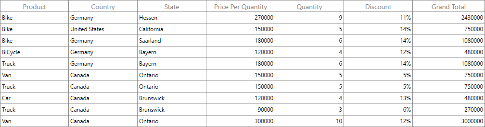
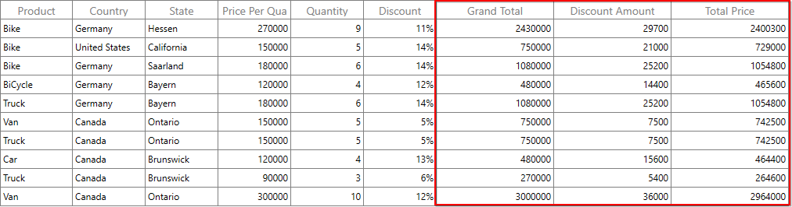
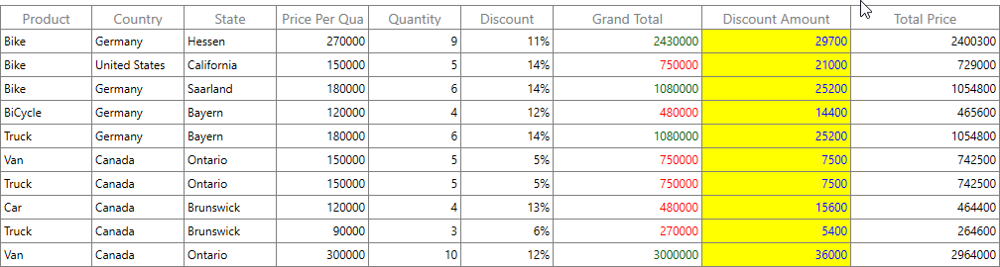

# How to Create WPF DataGrid with Calculated Columns (Unbound Columns)?

## About the sample

This example illustrates how to create [WPF DataGrid](https://www.syncfusion.com/wpf-controls/datagrid) with calculated columns (unbound columns).

`DataGrid` allows you to add **additional columns** which are **not bound with data object** from underlying data source. You can add unbound column using [GridUnBoundColumn](https://help.syncfusion.com/cr/wpf/Syncfusion.UI.Xaml.Grid.GridUnBoundColumn.html) class. Unbound columns supports for sorting, filtering, grouping, exporting and printing as normal columns.  

```XML
<syncfusion:GridUnBoundColumn  Width="150"                      
                               AllowEditing="False"
                               Expression="Quantity*Amount"  
                               HeaderText="Grand Total"         
                               MappingName="GrandTotal"
                               TextAlignment="Right" />

```



#### Note: It is mandatory to specify the GridColumn.MappingName for GridUnBoundColumn with some name to identify the column. It is not necessary to define name of field in the data object.

## Populating data for unbound column Using Expression

You can specify the arithmetic or logic expression using [Expression](https://help.syncfusion.com/cr/wpf/Syncfusion.UI.Xaml.Grid.GridUnBoundColumn.html#Syncfusion_UI_Xaml_Grid_GridUnBoundColumn_Expression) property to compute the display value. By default `GridUnBoundColumn` evaluates the expression with casing. You can disable the casing while evaluate the expression by setting [CaseSensitive](https://help.syncfusion.com/cr/wpf/Syncfusion.UI.Xaml.Grid.GridUnBoundColumn.html#Syncfusion_UI_Xaml_Grid_GridUnBoundColumn_CaseSensitive) property to false.

```XML
<syncfusion:SfDataGrid x:Name="dataGrid"    
                        AutoGenerateColumns="False"
                        ColumnSizer="Star"
                        AllowEditing="True"
                        ItemsSource="{Binding ProductInfo}">
    <syncfusion:SfDataGrid.Columns>
        <!--  UnBoundColumn with Expressions  -->
        <syncfusion:GridUnBoundColumn Width="150"
                                    AllowEditing="False"
                                    Expression="Quantity*Amount"
                                    HeaderText="Grand Total"
                                    MappingName="GrandTotal"
                                    TextAlignment="Right" />

        <syncfusion:GridUnBoundColumn Width="150"
                                    AllowEditing="False"
                                    Expression="Amount*Discount/100"
                                    HeaderText="Discount Amount"
                                    MappingName="DiscountAmount"
                                    TextAlignment="Right" />

        <syncfusion:GridUnBoundColumn Width="150"
                                    Expression="((Quantity*Amount) - (Amount*Discount/100))"
                                    HeaderText="Total Price"
                                    MappingName="TotalPrice" />
    </syncfusion:SfDataGrid.Columns>
</syncfusion:SfDataGrid>
```



Below are the list of Arithmetic and logical operations supported.

|   Arithmetic operations  |  Operator |
| -------------------------|:---------:| 
|    Add                   |     +     | 
|    Subtract              |     -     |  
|    Multiply              |     *     |  
|    Divide                |     /     | 
|    Power                 |     ^     |  
|    Mod                   |     %     |  
|    Greater Than          |     >     |  
|    Less Than             |     <     |  
|    Equal                 |     =     | 
|    GreaterThanOrEqual    |     >=    |  
|    LessThanOrEqual       |     <=    |  


|   Logical operations	|   Operators |
| ----------------------|:-----------:| 
|       AND	            |  (char)135  |
|       OR	            |  (char)136  |
|       NOT	            |  (char)137  |


## Refreshing the unbound column at runtime

You can recalculate the value for the cells of unbound column at runtime by calling [UpdateUnboundColumn](https://help.syncfusion.com/cr/wpf/Syncfusion.UI.Xaml.Grid.Helpers.GridHelper.html#Syncfusion_UI_Xaml_Grid_Helpers_GridHelper_UpdateUnboundColumn_Syncfusion_UI_Xaml_Grid_SfDataGrid_System_Object_System_String_) method.

```C#
this.dataGrid.CurrentCellEndEdit += dataGrid_CurrentCellEndEdit;

void dataGrid_CurrentCellEndEdit(object sender, CurrentCellEndEditEventArgs args)
{
      //Refreshing the DisCount unbound column at runtime
      this.dataGrid.UpdateUnboundColumn(this.dataGrid.CurrentItem, "Discount");
}
```

## Styling unbound column

You can customize the style of unbound column by writing style of TargetType [GridCell](https://help.syncfusion.com/cr/wpf/Syncfusion.UI.Xaml.Grid.GridCell.html) or setting [GridColumn.CellStyle](https://help.syncfusion.com/cr/wpf/Syncfusion.UI.Xaml.Grid.GridColumnBase.html#Syncfusion_UI_Xaml_Grid_GridColumnBase_CellStyle) property. Underlying record will be the DataContext for `GridCell`.

```XML
<Window.Resources>
    <Style x:Key="ApplyCellStyle" TargetType="syncfusion:GridCell">
        <Style.Resources>
            <ResourceDictionary>
                <Style TargetType="TextBlock" />
            </ResourceDictionary>
        </Style.Resources>
        <Setter Property="Foreground" Value="Blue" />
        <Setter Property="Background" Value="Yellow"/>
    </Style>

    <local:UnboundCellStyleConverter x:Key="unboundCellStyleConverter"/>
</Window.Resources>

 <syncfusion:SfDataGrid x:Name="dataGrid"    
                        AutoGenerateColumns="False"
                        ColumnSizer="Star"
                        AllowEditing="True"
                        ItemsSource="{Binding ProductInfo}">
    <syncfusion:SfDataGrid.Columns>
        <!--  UnBoundColumn with Expressions  -->
        <syncfusion:GridUnBoundColumn Width="150"                      
        AllowEditing="False"
        Expression="Quantity*Amount"  
        HeaderText="Grand Total"         
        MappingName="GrandTotal"
        TextAlignment="Right" >
            <syncfusion:GridUnBoundColumn.CellStyle>
                <Style TargetType="syncfusion:GridCell">
                    <Setter  Property="Foreground"  Value="{Binding   RelativeSource={RelativeSource Self}, Converter={StaticResource unboundCellStyleConverter}}" />
                </Style>
            </syncfusion:GridUnBoundColumn.CellStyle>
        </syncfusion:GridUnBoundColumn>

        <syncfusion:GridUnBoundColumn 
        Width="150"                      
        AllowEditing="False"
        Expression="Amount*Discount/100"
        CellStyle="{StaticResource ApplyCellStyle}" 
        HeaderText="Discount Amount"     MappingName="DiscountAmount"
        TextAlignment="Right" />

        <syncfusion:GridUnBoundColumn
        Width="150"                      
        AllowEditing="False"
        Expression="((Quantity*Amount) - (Amount*Discount/100))"
        HeaderText="Total Price"         MappingName="TotalPrice" 
        TextAlignment="Right" />
    </syncfusion:SfDataGrid.Columns>
</syncfusion:SfDataGrid>
```

The following screenshot shows the cell style applied [GridUnBoundColumn](https://help.syncfusion.com/cr/wpf/Syncfusion.UI.Xaml.Grid.GridUnBoundColumn.html),



You can refer the [Styling](https://help.syncfusion.com/wpf/datagrid/column-types#column-styling) section of [GridColumn](https://help.syncfusion.com/cr/wpf/Syncfusion.UI.Xaml.Grid.GridColumn.html) for more information.

Take a moment to peruse the [documentation](https://help.syncfusion.com/wpf/datagrid/unbound-column), where you can find about [GridUnBoundColumn](https://help.syncfusion.com/cr/wpf/Syncfusion.UI.Xaml.Grid.GridUnBoundColumn.html), with code examples.

## Requirements to run the demo
Visual Studio 2015 and above versions